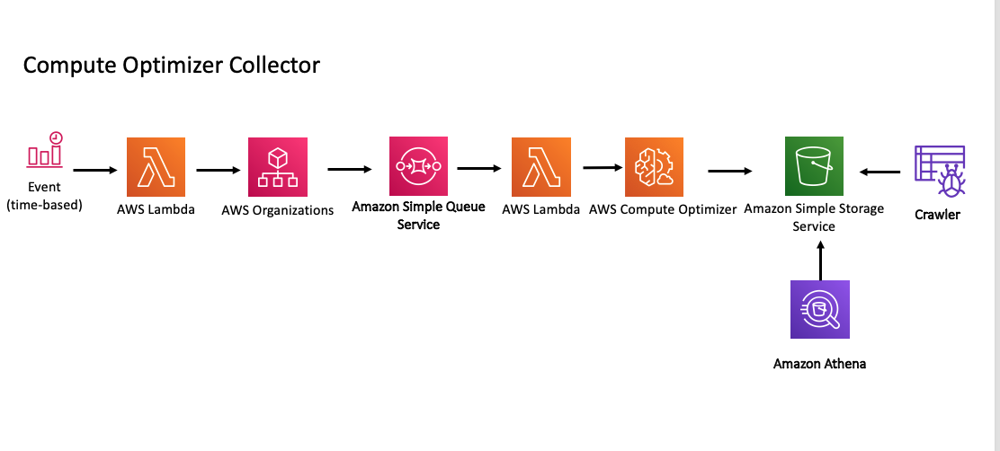

# Compute optimizer collector

The purpose of this module is to collect all compute optimization recommendations from all accounts either in an organization or specific ids you pass in, and put them into one location. This can then be queried using Athena.
It is to be deployed into the *management account* or any account that has access to the organizations data.

Example Queries can be found in the athena_queries folder.


## Usage

```
module "aws_tf_compute_optimiser_collector" {
  source = "/aws_tf_compute_optimiser_collector"
  bucket_name = "bucket name "
  athena_database = "Existing_athena_database_name"
  alarm_email = "example@email.com"
  region = "eu-west-1"
}
```

## Optional Inputs

| Name | Description | Type | Default | Required |
|------|-------------|:----:|:-----:|:-----:|
| bucket\_name | Bucket name for your CO data to be stored in that will be created| string | `""` | Yes
| athena\_database | Existing Athena database to query data from| string | `""` | Yes
| alarm\_email | Email to send alerts too| string | `"example@email.com"` | Yes
| env | End for the name of the resources created | string | `""` | no |
| region | Region it will be deployed into | string | `""` | yes |
Choice:
| enable_accounts_collector | This will pull your organization data into an sqs que and pass account ids into the CO function | bolean | `"true"` | no |
| enable_cloudwatch_event | This will all you to pass in selected account IDs rather than and org | boolean | `"false"` | no |
| specific_accounts | Pass in string in this format with account ids. Must have enable_cloudwatch_event as true "{ \"Records\":[ { \"messageId\":\"1\", \"body\":\"123456789\" }, {\"messageId\":\"2\", \"body\":\"987654312\" } ] }" | string | `""` | no |


## Diagram


## Testing  Deployment
* Go to AWS Lambda
* Find the *org_account_collector* lambda and run a test
* this will pass the account IDs into the SQS and then the compute_optimiser_collector lambda will run these
* the data will then be placed into the s3 bucket that was created

## Contribution Testing  

Configure your AWS credentials using one of the [supported methods for AWS CLI
   tools](https://docs.aws.amazon.com/cli/latest/userguide/cli-chap-getting-started.html), such as setting the
   `AWS_ACCESS_KEY_ID` and `AWS_SECRET_ACCESS_KEY` environment variables. If you're using the `~/.aws/config` file for profiles then export `AWS_SDK_LOAD_CONFIG` as "True".
1. Install [Terraform](https://www.terraform.io/) and make sure it's on your `PATH`.
1. Install [Golang](https://golang.org/) and make sure this code is checked out into your `GOPATH`.
cd test
go mod init github.com/sg/sch
go test -v -run TestTerraformAws

## Security

See [CONTRIBUTING](CONTRIBUTING.md#security-issue-notifications) for more information.

## License

This library is licensed under the MIT-0 License. See the LICENSE file.

